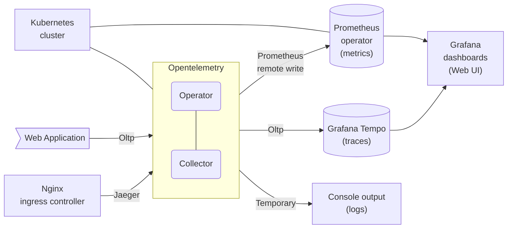

# OpenTele-17 - OpenTelemetry Case Study

Authors: Szymon Musiał, Paweł Kruczkiewicz, Marcin Kroczek, Krzysztof Maliszewski

2023, Implementation of Network Services

## Table of Contents
1. [Introduction](#introduction)
2. [Theoretical background](#theoretical-background)
3. [Case study concept description](#case-study-concept-description)
4. [Solution architecture](#solution-architecture)
5. [Environment configuration](#environment-configuration)
6. [Installation method](#installation-method)
7. [How to reproduce](#how-to-reproduce)
8. [Demo deployment](#demo-deployment)
9. [Summary](#summary)
10. [References](#references)
    - [Helm charts repo](#helm-charts-repo)

## Introduction
This project serves as a case study of observability using OpenTelemetry on an existing EmotoAGH application.
## Theoretical background

[OpenTelemetry](https://opentelemetry.io/) is is a vendor-neutral open-source [Observability](https://opentelemetry.io/docs/concepts/observability-primer/#what-is-observability) framework for instrumenting, generating, collecting, and exporting telemetry data such as traces, metrics, logs. OpenTelemetry’s goal is to provide a set of standardized vendor-agnostic SDKs, APIs, and tools for ingesting, transforming, and sending data to an Observability back-end (e.g. Jaeger,  Zipkin).

OpenTelemetry facilitates whole application observability, including:
### [Instrumenting](https://opentelemetry.io/docs/concepts/instrumenting/)
In order to make a system observable, code from the system’s components must emit traces, metrics, and logs. OTel provides two types of instrumentation:
- Automatic Instrumentation, that do not require the end-user to modify application’s source code,
- Manual Instrumentation, by coding against the OpenTelemetry API to collect telemetry from end-user

### [Data Collection](https://opentelemetry.io/docs/concepts/data-collection/)
The OpenTelemetry project facilitates the collection of telemetry data via the OpenTelemetry Collector. Collector offers a vendor-agnostic implementation on how to receive, process, and export telemetry data.


## Case study concept description

The proposed demonstration of using OpenTelemetry will consist of using a set of these tools in the EmotoAGH project's web application. The mentioned application is responsible for:

- Collecting measurements from motorcycles created in the project,
- Aggregating, sorting, filtering measurements,
- Securing access based on the RBAC concept,
- A sufficiently universal API used by the website and another team of mobile applications.


It is publicly available, and its availability options are based on the user roles declared.
The application is available on bare-metal Kubernetes on Oracle OCI machines. We plan to use the mentioned project to observe its behaviors, events, logs, metrics and potential errors by deploying appropriate OpenTelemetry tools.


## Solution architecture



## Environment configuration

The configuration of the environment depends on the location where the applications are deployed. This can be a local version of Kubernetes, such as [k3d](https://k3d.io) or [kind](https://kind.sigs.k8s.io/). In our case, a ready-made cluster was used, which was configured using kubespray.


The configuration of the observed application involves providing the appropriate address, which is the endpoint of the OpenTelemetry Receiver.

In our case web application contains code shown below

```c#
using Domain.Models;

public static IServiceCollection AddAppOpenTelemetryMetrics(this IServiceCollection services, AppConfiguration appConfiguration)
{
    if (appConfiguration.PanelEmotoAgh_OtlpExporterEndpoint is null)
    {
        return services;
    }

    services.AddOpenTelemetry()
        .WithMetrics(metricsProviderBuilder => metricsProviderBuilder
            .SetResourceBuilder(CreateAppOtelResource(appConfiguration))
            .AddAspNetCoreInstrumentation()
            .AddRuntimeInstrumentation()
            .AddOtlpExporter(e => e.Endpoint = new Uri(appConfiguration.PanelEmotoAgh_OtlpExporterEndpoint)));

    return services;
}

public static IServiceCollection AddAppOpenTelemetryTracing(this IServiceCollection services, AppConfiguration appConfiguration)
{
    if (appConfiguration.PanelEmotoAgh_OtlpExporterEndpoint is null)
    {
        return services;
    }

    services.AddOpenTelemetry()
        .WithTracing(tracerProviderBuilder => tracerProviderBuilder
            .SetResourceBuilder(CreateAppOtelResource(appConfiguration))
            .AddAspNetCoreInstrumentation()
            .AddEntityFrameworkCoreInstrumentation(o =>
            {
                o.SetDbStatementForText = true;
                o.SetDbStatementForStoredProcedure = true;
            }));

    return services;
}

public static ILoggingBuilder AddAppOpenTelemetryLogs(this ILoggingBuilder loggingBuilder, AppConfiguration appConfiguration)
{
    if (appConfiguration.PanelEmotoAgh_OtlpExporterEndpoint is null)
    {
        return loggingBuilder;
    }

    return loggingBuilder.AddOpenTelemetry(options => options
        .SetResourceBuilder(CreateAppOtelResource(appConfiguration))
        .AddOtlpExporter(o => o.Endpoint = new Uri(appConfiguration.PanelEmotoAgh_OtlpExporterEndpoint))
    );
}

static internal ResourceBuilder CreateAppOtelResource(AppConfiguration appConfiguration)
{
    var resourceBuilder = ResourceBuilder.CreateDefault();
    resourceBuilder.AddService(
       serviceName: appConfiguration.PanelEmotoAgh_OtlpServiceName,
       serviceInstanceId: Environment.MachineName); // Pod name in k8 cluster
    return resourceBuilder;
}
```
This extension is used at application starting point

```c#
builder.Services.AddAppOpenTelemetryMetrics(appConfiguration);
builder.Services.AddAppOpenTelemetryTracing(appConfiguration);
builder.Logging.AddAppOpenTelemetryLogs(appConfiguration);
```

Web application use global error handling so every exception will be passed via this part of code, what is responsible for append exception information into trace

```c#
internal static void RecordExceptionToTrace(Exception? exception)
{
    var activity = Activity.Current;

    if (activity is null && exception is null)
    {
        return;
    }

    // Add App domain error codes
    if (exception is AppException appException)
    {
        activity?.AddTag(nameof(AppException.AppErrorCodes), string.Join(", ", appException.AppErrorCodes));
    }

    while (activity != null)
    {
        activity.RecordException(exception);
        activity.Dispose();
        activity = activity.Parent;
    }
}
```

## Installation method

In the example, we were observing a running application. To carry out the demo, adding the appropriate deployments is required. Therefore, on the computer that will be configuring the cluster, installing and configuring kubectl, as well as the helm deployment repositories, is necessary.

## How to reproduce

Do next step ? XD

## Demo deployment

   
First we should add required [repositories](#helm-charts-repo)

```sh
helm repo add prometheus https://prometheus-community.github.io/helm-charts
helm repo add open-telemetry https://open-telemetry.github.io/opentelemetry-helm-charts
helm repo add grafana https://grafana.github.io/helm-charts
helm repo update
```

Finally, we should have similar output
```sh
$ helm repo list
NAME            URL
prometheus      https://prometheus-community.github.io/helm-charts
open-telemetry  https://open-telemetry.github.io/opentelemetry-helm-charts
grafana         https://grafana.github.io/helm-charts
```

## Prometheus deployment

```sh
helm upgrade \
    --debug \
    --install kube-prometheus-stack \
    prometheus/kube-prometheus-stack \
    -f kube_prometheus_stack.yaml \
    --namespace observability \
    --create-namespace
```
Used chart values: [`kube_prometheus_stack.yaml`](./kube_prometheus_stack.yaml)

```yaml
prometheus:
  prometheusSpec:
    enableRemoteWriteReceiver: true

grafana:
  ingress:
    enabled: true
    # ....

  additionalDataSources:
  - name: Tempo
    editable: true
    type: tempo
    url: http://tempo.observability.svc:3100
    # ....
```

The Prometheus operator leverages the ability to read the cluster's configuration to obtain information about the installed components and gather metrics from them.

Command shown above is modified. This adds ingress definition with ssl certificate make possible to open grafana dashboards

Also we enabled `enableRemoteWriteReceiver` to allow sending metrics from OpenTelemetry exporter to prometheus. It's push based approach.

### Grafana Tempo 

To save traces we deploy Grafana Tempo using monolithic mode. OpenTelemetry Collector is High availability (Deamon set), so we don't need microservice mode.

[In config file](./kube_prometheus_stack.yaml) we use remote write to send metrics to prometheus to see ex. error spans in grafana dashboard and navigate to span wht generated this error

```sh
helm upgrade \
    --install tempo \
    grafana/tempo \
    -f grafana_tempo.yaml \
    --namespace observability \
    --create-namespace
```

Used chart values: [`grafana_tempo.yaml`](./grafana_tempo.yaml)

```yaml
storage:
  trace:
    backend: local # can be AWS s3
    # ...

tempo:
  metricsGenerator:
    enabled: true
    remoteWriteUrl: http://kube-prometheus-stack-prometheus.observability.svc:9090/api/v1/write

tempoQuery:
  enabled: false
```

### OpenTelemetry

Next we should have installed Cert manager, what is OpenTelemetry operator dependency

```sh
wget https://github.com/cert-manager/cert-manager/releases/download/v1.11.0/cert-manager.yaml
kubectl apply -f ./cert-manager.yaml
```

Now we add OpenTelemetry Operator initial configuration ??
```sh
helm upgrade \
    --install opentelemetry-operator \
    open-telemetry/opentelemetry-operator \
    --namespace observability \
    --create-namespace
```

We are ready do deploy OpenTelemetry Collector. We can achieve this using few different kinds os deployments. To keep short route between pods and OpenTelemety receivers we use `DeamonSet`. So we have one pod with collector on every node and it's carry about process and export telemetry

To do that we apply [DeamonSet definition](./OpenTelemetryCollector.yaml) shwown below

```yaml
apiVersion: opentelemetry.io/v1alpha1
kind: OpenTelemetryCollector
metadata:
  name: my-collector
  namespace: observability
spec:
  mode: daemonset
  config: |
    receivers:
      otlp:
        protocols:
          grpc:
          http:
      jaeger:
        protocols:
          grpc:
          thrift_compact:
    processors:

    exporters:
      logging:
        loglevel: debug
      otlp:
        endpoint: tempo.observability.svc:4317
        tls:
          insecure: true
      prometheusremotewrite:
        endpoint: http://kube-prometheus-stack-prometheus.observability.svc:9090/api/v1/write

    service:
      pipelines:
        traces:
          receivers: [otlp, jaeger]
          processors: []
          exporters: [otlp]
        metrics:
          receivers: [otlp]
          processors: []
          exporters: [prometheusremotewrite]
        logs:
          receivers: [otlp]
          processors: []
          exporters: [logging]
```

Also we specify 2 receivers protocols: otlp, jaeger.

We save traces into Grafana Tempo using otlp protocol, and metric into Prometheus using `remote write receiver`


Finally we can use `http://my-collector-collector.observability.svc:4317` endpoint to pass into web app configuration and observe.
In our case i pass this variable using gitlab ci/cd variable section.
For demo purposes, we didn't use [.Net automatic Instrumentation](https://opentelemetry.io/docs/instrumentation/net/automatic/)


Additionally for presentation we configure Nginx ingress controller to send tracing. This can be done by modify [ingress config maps](./Configmap-ingress-nginx.yaml)

```yaml
apiVersion: v1
data:
  enable-opentracing: "true"
  jaeger-collector-host: my-collector-collector.observability.svc
  jaeger-collector-port: "6831"
  jaeger-propagation-format: w3c
  jaeger-service-name: nignx-ingresss-controller
  jaeger-trace-context-header-name: request-id
  opentracing-trust-incoming-span: "true"
kind: ConfigMap
# ....
```

Opentracing was used because cluster have installed 1.3.1 version of nginx ingress controller. Starting from 1.4.0 opentelemetry support was added


## Summary

https://grafana.emotoagh.eu.org/

## References

- [OpenTelemetry](https://opentelemetry.io)
- [OpenTelemetry in ASP.Net web application](https://opentelemetry.io/docs/instrumentation/net/libraries/)
- [Prometheus Operator](https://github.com/prometheus-operator/prometheus-operator)
- [OpenTelemetry Operator for Kubernetes](https://opentelemetry.io/docs/k8s-operator)
- [Cert manager](https://cert-manager.io/docs/installation)
- [Grafana Tempo](https://grafana.com/oss/tempo)

### Helm charts repo:

- [Prometheus Helm](https://github.com/prometheus-community/helm-charts)
- [OpenTelemetry Operator](https://github.com/open-telemetry/opentelemetry-helm-charts/tree/main/charts/opentelemetry-operator)
- [Grafana Tempo](https://github.com/grafana/helm-charts/tree/main/charts/tempo)

